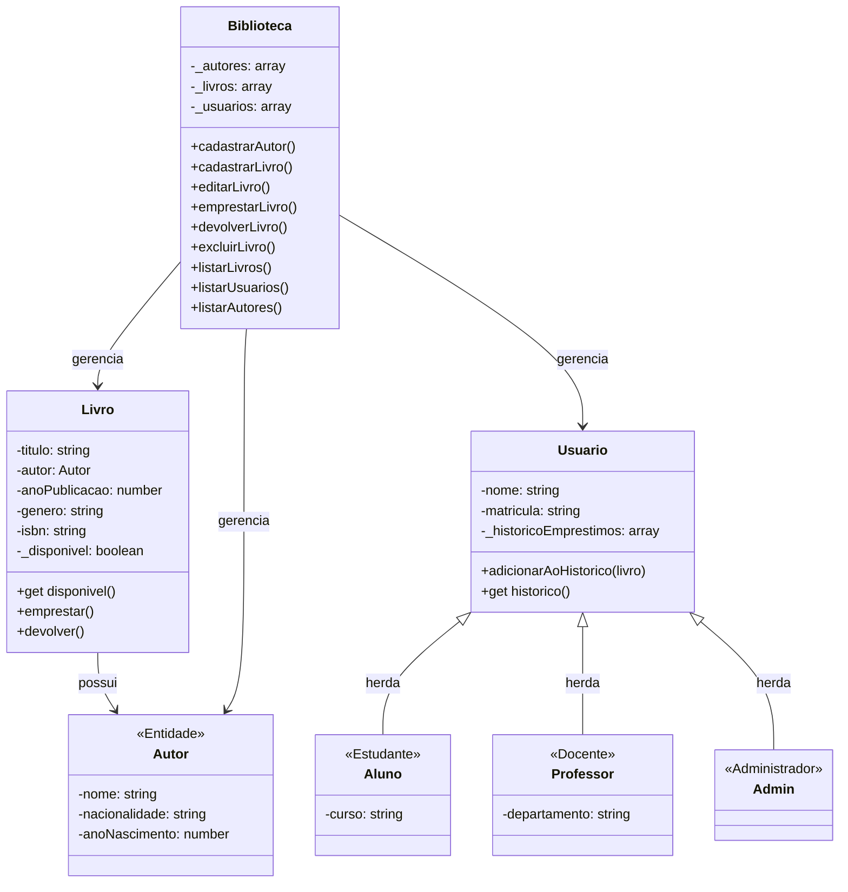

# Sistema de Gestão de Biblioteca - Documentação

> Última atualização: 28 de agosto de 2025

## Visão Geral

Este sistema implementa uma biblioteca digital com suporte a múltiplos tipos de usuários, gerenciamento de livros e autores, e persistência de dados via localStorage. O sistema é acessado via console do navegador e fornece uma interface HTML para documentação e instruções.

## Diagrama UML Simplificado



## Descrição das Classes

### 1. Usuario (Classe Base)

- **Atributos**:
  - nome: string
  - matricula: string
  - \_historicoEmprestimos: array
- **Métodos**:
  - adicionarAoHistorico(livro)
  - get historico()

### 2. Aluno (Herda de Usuario)

- **Atributos Adicionais**:
  - curso: string

### 3. Professor (Herda de Usuario)

- **Atributos Adicionais**:
  - departamento: string

### 4. Admin (Herda de Usuario)

- Não possui atributos adicionais
- Possui permissões especiais para excluir livros

### 5. Livro

- **Atributos**:
  - titulo: string
  - autor: Autor
  - anoPublicacao: number
  - genero: string
  - isbn: string
  - \_disponivel: boolean
- **Métodos**:
  - get disponivel()
  - emprestar()
  - devolver()

### 6. Autor

- **Atributos**:
  - nome: string
  - nacionalidade: string
  - anoNascimento: number

### 7. Biblioteca

- **Atributos**:
  - \_autores: array
  - \_livros: array
  - \_usuarios: array
- **Métodos**:
  - cadastrarAutor(nome, nacionalidade, anoNascimento)
  - cadastrarLivro(titulo, nomeAutor, anoPublicacao, genero, isbn)
  - editarLivro(isbn, dadosParaAtualizar)
  - emprestarLivro(isbn, matriculaUsuario)
  - devolverLivro(isbn)
  - excluirLivro(isbn, adminExecutor)
  - listarLivros()
  - listarUsuarios()
  - listarAutores()

## Funcionalidades do Sistema

### 1. Gerenciamento de Usuários

- Suporte a diferentes tipos de usuários (Aluno, Professor, Admin)
- Histórico de empréstimos para cada usuário
- Controle de acesso baseado no tipo de usuário

### 2. Gerenciamento de Livros

- Cadastro completo de livros com validações
- Controle de disponibilidade
- Sistema de empréstimo e devolução
- Exclusão de livros (somente para administradores)

### 3. Gerenciamento de Autores

- Cadastro de autores com informações completas
- Vinculação de autores aos livros
- Listagem de autores cadastrados

### 4. Persistência de Dados

- Utilização do LocalStorage para salvar dados
- Carregamento automático dos dados ao iniciar
- Dados iniciais de exemplo para primeira execução

## Como Usar

### Console do Navegador

1. **Listar Dados**:

```javascript
biblioteca.listarLivros();
biblioteca.listarUsuarios();
biblioteca.listarAutores();
```

2. **Cadastrar Novo Autor**:

```javascript
biblioteca.cadastrarAutor("Nome", "Nacionalidade", anoNascimento);
```

3. **Cadastrar Novo Livro**:

```javascript
biblioteca.cadastrarLivro(titulo, nomeAutor, anoPublicacao, genero, isbn);
```

4. **Editar um Livro Existente**:

```javascript
//O segundo parâmetro é um objeto com os campos a serem alterados
biblioteca.editarLivro("ISBN-do-livro", {
  titulo: "Novo Título",
  anoPublicacao: 2025,
});
```

5. **Operações com Livros**:

```javascript
biblioteca.emprestarLivro(isbn, matriculaUsuario);
biblioteca.devolverLivro(isbn);
```

6. **Operações Administrativas**:

```javascript
// Primeiro, obter referência do admin
const admin = biblioteca._usuarios.find((u) => u.matricula === "ADMIN-001");
// Depois, executar operação
biblioteca.excluirLivro(isbn, admin);
```

## Boas Práticas Implementadas

1. **Encapsulamento**

   - Uso de atributos privados com prefixo \_
   - Implementação de getters e setters
   - Proteção de dados sensíveis

2. **Herança**

   - Hierarquia clara de usuários
   - Reutilização de código
   - Extensibilidade do sistema

3. **Polimorfismo**

   - Diferentes tipos de usuários
   - Comportamentos específicos por tipo
   - Fácil adição de novos tipos

4. **Validações**

   - Verificação de dados obrigatórios
   - Controle de disponibilidade de livros
   - Verificação de permissões

5. **Modularização**
   - Separação clara de responsabilidades
   - Código organizado em módulos
   - Fácil manutenção e extensão

## Possíveis Melhorias Futuras

1. Implementação de sistema de reservas
2. Adicionar prazo para empréstimos
3. Sistema de multas por atraso
4. Busca avançada por diferentes critérios
5. Interface gráfica para usuários
6. Sistema de notificações
7. Relatórios e estatísticas
8. Integração com sistemas externos
